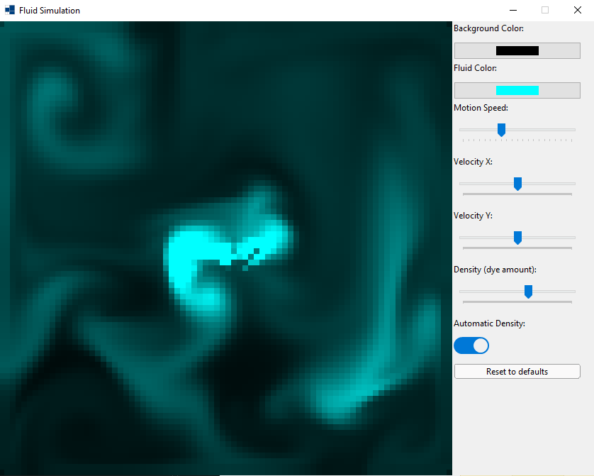

# xtd_fluid_simulation
[](https://github.com/baderouaich/Fluid-Simulation)

Redoing [Fluid Simulation](https://github.com/baderouaich/Fluid-Simulation), with xtd for more runtime controls!

# Run
```sh
xtdc run --release
```
It is important to run in Release mode, unless you have a super fast CPU.

## References

All fluid simulating functions were taken from this tutorial -> [Fluid Simulation For Dummies](https://mikeash.com/pyblog/fluid-simulation-for-dummies.html).
<sub>By the time i followed the tutorial, God helped me to understand a bit on how it works. Now, only he knows..</sub>